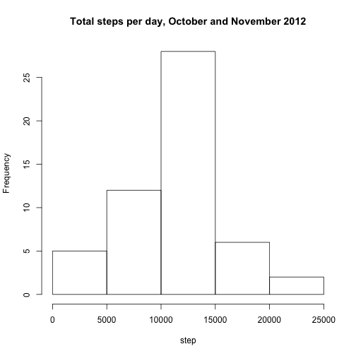
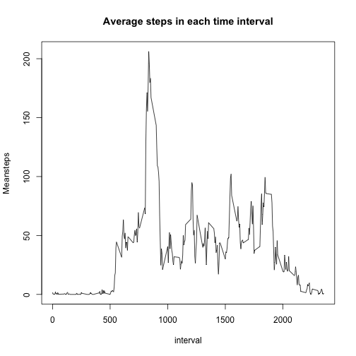
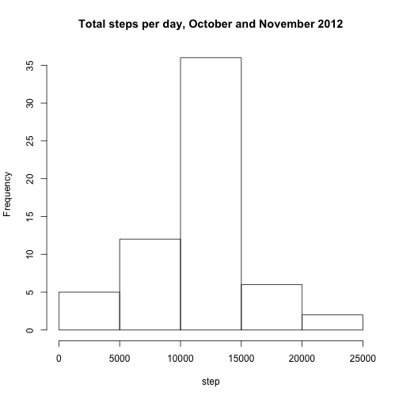
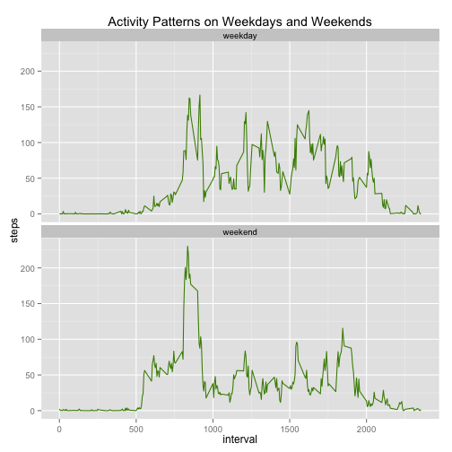

###Introduction
This assignment makes use of data from a personal activity monitoring device. This device collects data at 5 minute intervals through out the day. The data consists of two months of data from an anonymous individual collected during the months of October and November, 2012 and include the number of steps taken in 5 minute intervals each day.  

###Loading and preprocessing the data
To start with the Activity Monitoring Data Set was imported into RStudio with the following commands.


```r
temp=tempfile()
download.file("https://d396qusza40orc.cloudfront.net/repdata%2Fdata%2Factivity.zip",temp
             ,method="curl")
data=unzip(temp);
unlink(temp)
data=read.csv(data)
```
###What is mean total number of steps taken per day?
In this part of the assignment the sum of the number of steps of each day was extracted from the original data. The histogram of the new dataset, histdata, was plotted and then the mean and the median of histdata was computed.

```r
library(plyr)
histdata=ddply(data,.(date),summarize,steps=sum(steps))
hist(histdata$steps,main="Total steps per day, October and November 2012",xlab="step")
```

 

```r
mean(histdata[,2],na.rm=T)
```

```
## [1] 10766.19
```

```r
median(histdata[,2],na.rm=T)
```

```
## [1] 10765
```
###What is the average daily activity pattern?
With the same function, the average of steps in each interval of the day was extracted over the two months. The daily steps pattern data set, timeseries, was then plotted as a lineplot with interval on the x-axis and steps on the y-axis. Then the index of which interval included the maximum average steps taken in the timeseries data set was found.


```r
timeseries=ddply(data,.(interval),summarize,Meansteps=mean(steps,na.rm=T))
plot(timeseries,type="l",main="Average steps in each time interval")
```

 

```r
#Find which interval has the max meansteps using which.max function
timeseries[which.max(timeseries$Meansteps),]
```

```
##     interval Meansteps
## 104      835  206.1698
```

###Imputing missing values
Now the missing values were handled in the original data set. First, the number of missing values was computed. Then the missing values were imputed with mean values of the respective interval that the missing data was in with the help of a homemade function, NAimpute. The NA imputed data was rearranged in the way the original data set was set up and then a histogram was plotted from the datawithNA data set as in the first part of this assignment.


```r
sum(is.na(data))
```

```
## [1] 2304
```

```r
NAimpute<-function(x){
x[is.na(x)] = mean(x, na.rm=TRUE)
x
}

NAimputedata=ddply(data,.(interval),summarize,steps=NAimpute(steps))
adddate=cbind(histdata$date,NAimputedata)
#reorder the columns like in the original dataset
adddate=adddate[,c(3,1,2)]
names(adddate)=names(data)
datawithNA=adddate[order(adddate$date),]
#same calculations as in the first part with missing values imputed to the dataset
histNA=ddply(datawithNA,.(date),summarize,steps=sum(steps))
hist(histNA$steps,main="Total steps per day, October and November 2012",xlab="step")
```

 

```r
mean(histNA$steps)
```

```
## [1] 10766.19
```

```r
median(histNA$steps)
```

```
## [1] 10766.19
```

###Are there differences in activity patterns between weekdays and weekends?
The datawithNA data set with imputed missing values was extended and a new variable added to it which determined if the days in the data set were a weekday or a weekend using ifWeekday function from timeDate package. Then the data set was subsetted so that average amount of steps of each interval was found and in each interval it gave the average steps in weekdays as opposed to weekends.This difference was plotted in a two panel plot using ggplot2 package.


```r
library(timeDate)
library(ggplot2)
#isWeekday returns boolean values which were labeled in the following way
datawithNA$weekday=factor(isWeekday(data$date),labels=c("weekday","weekend"))
dataweekdays=ddply(datawithNA,.(interval,weekday),summarize,steps=mean(steps))
ggplot(dataweekdays, aes(interval,steps)) + geom_line(color="chartreuse4")+
        facet_wrap(~weekday, nrow=2) + ggtitle("Activity Patterns on Weekdays and Weekends")
```

 
